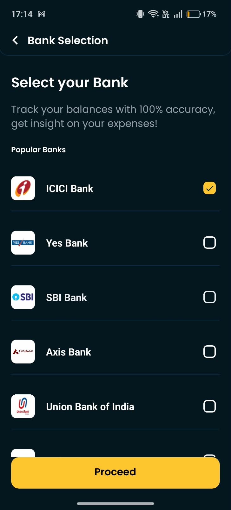
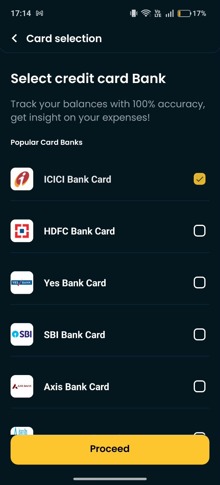
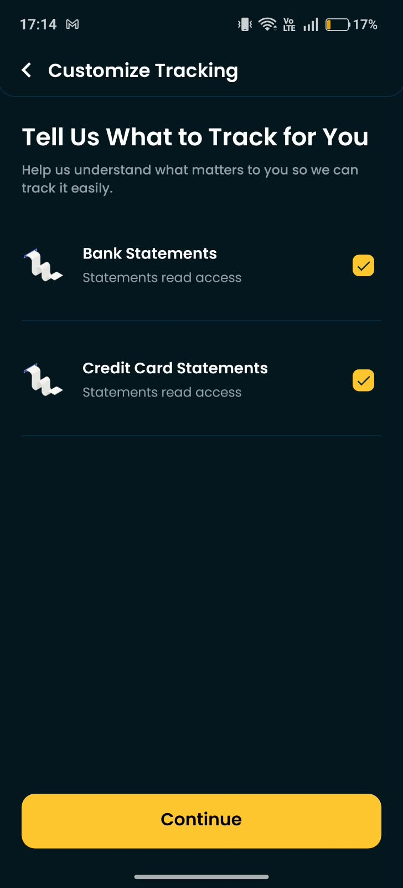
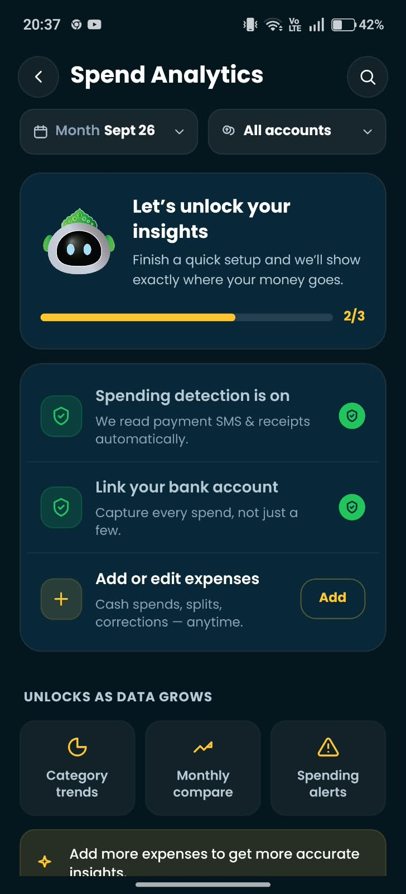
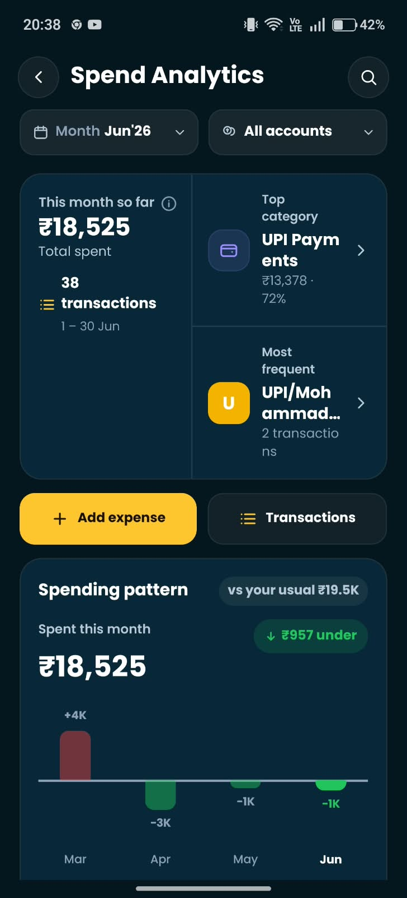
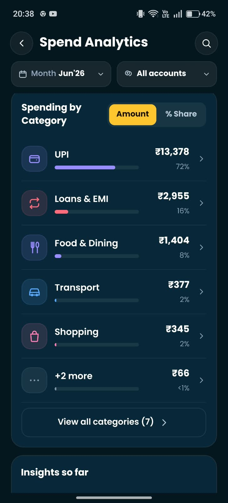
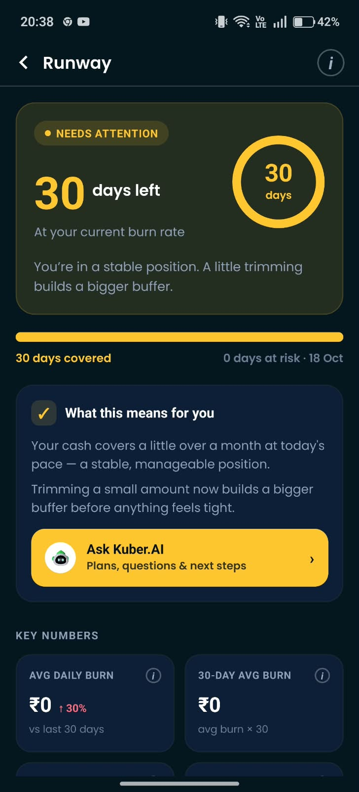
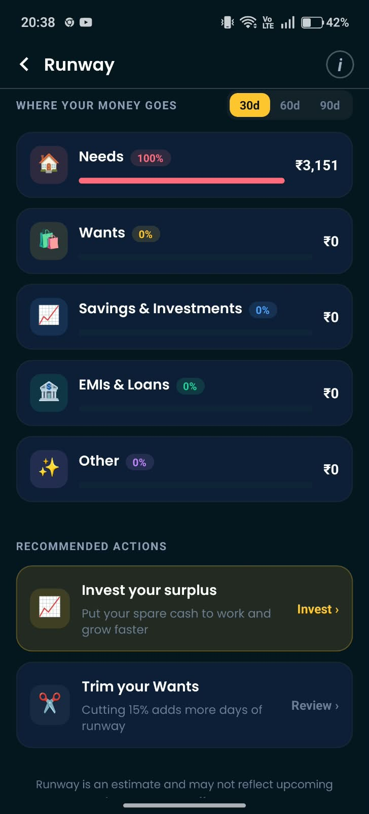
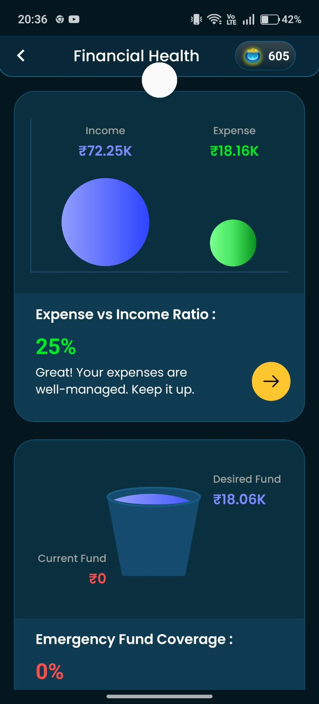
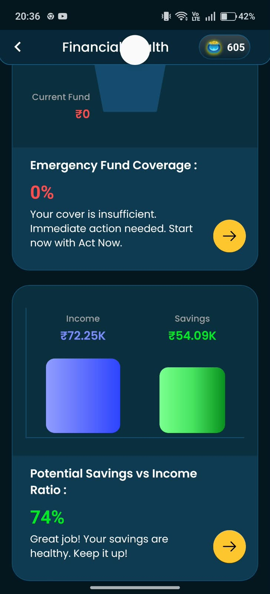

# Task 1 — Track Flow Teardown

## Setup Flow

**Bank & Card Selection:** The onboarding asks you to pick your bank (ICICI) and credit card bank separately, then choose what to track (Bank Statements, Credit Card Statements). Clean and quick — two taps each.

  
  
  

**Gmail Connection:** After granting access, the app shows exactly what it did: "Read statements from 2 sources, encrypted & added to dashboard." It also explicitly says "Personal & work mail was never opened" and "Shared nothing with anyone." This transparency matters — you're handing over financial data and knowing the boundary helps.

**SMS Permission:** Spending detection turns on automatically after granting SMS access. No manual step needed. The "2/3" setup progress bar pushed me to also link a bank account.

## What Track Produced

For June 2026, Track found **38 transactions** totaling **₹18,525** across 7 categories:

| Category | Amount | Share |
|----------|--------|-------|
| UPI | ₹13,378 | 72% |
| Loans & EMI | ₹2,955 | 16% |
| Food & Dining | ₹1,404 | 8% |
| Transport | ₹377 | 2% |
| Shopping | ₹345 | 2% |
| +2 more | ₹66 | <1% |

Financial Health score: **605**. Income: ₹72.25K. Expense: ₹18.16K. Expense-to-income ratio: 25%.

## Two Transactions It Got Wrong

1. **"UPI" is not a category — it's a payment method.** 72% of my spending is labelled "UPI" which tells me nothing about where the money actually went. A ₹200 UPI payment to Swiggy should be "Food & Dining", a ₹50 UPI to an auto driver should be "Transport." The app knows the merchant name from the SMS (e.g., "UPI/Mohammad...") but doesn't use it to categorize. This is the single biggest gap — the dominant category is meaningless.

   

2. **Runway shows ₹0 average daily burn despite ₹18,525 in spending.** The Runway screen says "Avg Daily Burn: ₹0" and "30-Day Avg Burn: ₹0" while simultaneously showing ₹3,151 under "Needs." If I spent ₹18,525 across 30 days, the daily burn should be ~₹617. Something in the calculation is either broken or the Runway feature is pulling from a different data source than Spend Analytics.

   

## Where I Trusted It, Where I Didn't

**Trusted:**
- The Gmail connection flow. The "what we did / what we left alone" screen is the best permission transparency I've seen in a finance app. I believed it because the specificity ("2 sources") matched what I expected.
- The total spend number (₹18,525) and transaction count (38) felt right against what I roughly knew from my bank statements.
- The month-over-month spending pattern chart ("₹957 under your usual ₹19.5K") — useful and immediately actionable.

**Did not trust:**
- The category breakdown. When 72% of spending is "UPI", the categorization is doing almost nothing. I can't act on "you spent ₹13,378 on UPI."
- The Runway numbers. ₹0 daily burn contradicts the ₹18,525 total spend on the same screen. If the numbers disagree with each other, I don't trust either.

  

- Emergency Fund Coverage showing 0% with "Immediate action needed" — this feels alarmist when my savings-to-income ratio is 74% (shown on the same Financial Health page). Mixed signals.

  

    
    
  

## Three Things I'd Change

1. **Resolve UPI into real categories.** The SMS body contains the merchant name after "UPI/" — use it. Map "UPI/Swiggy" to Food, "UPI/Ola" to Transport, "UPI/Amazon" to Shopping. Even a rough keyword match would turn 72% of uncategorized spend into something useful. This is literally what the ledger-sync engine I built for Task 2 does with the merchant field.

2. **Fix the Runway daily-burn calculation.** Either the data pipeline feeding Runway is disconnected from Spend Analytics, or there's a filter (date range, account) that's silently excluding transactions. When two screens in the same app disagree about how much I spent, the user loses confidence in both.

3. **Don't show a category breakdown that's dominated by a payment method.** If UPI can't be resolved to real categories yet, group it as "Uncategorized" and say so honestly ("We detected ₹13,378 in UPI payments — help us categorize them"). Labelling a payment rail as a spending category makes the whole analytics screen feel like it's not ready.
